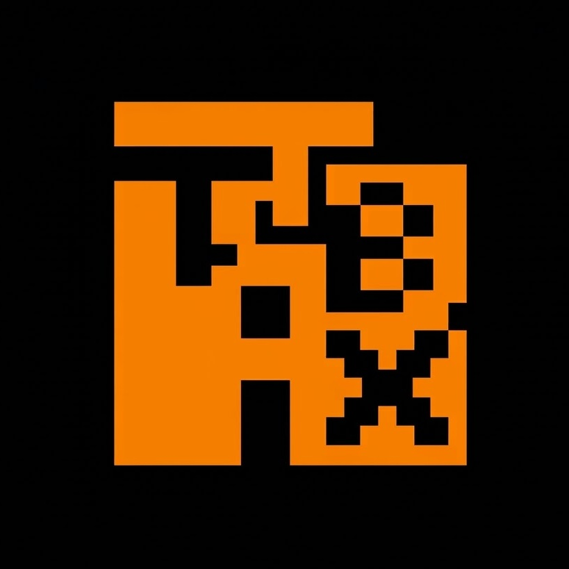
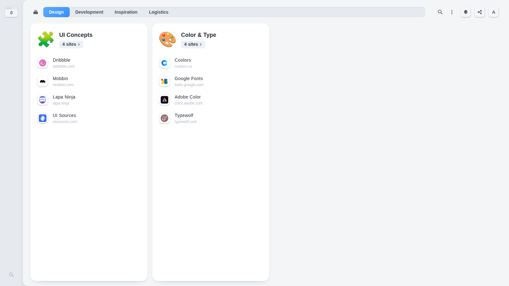
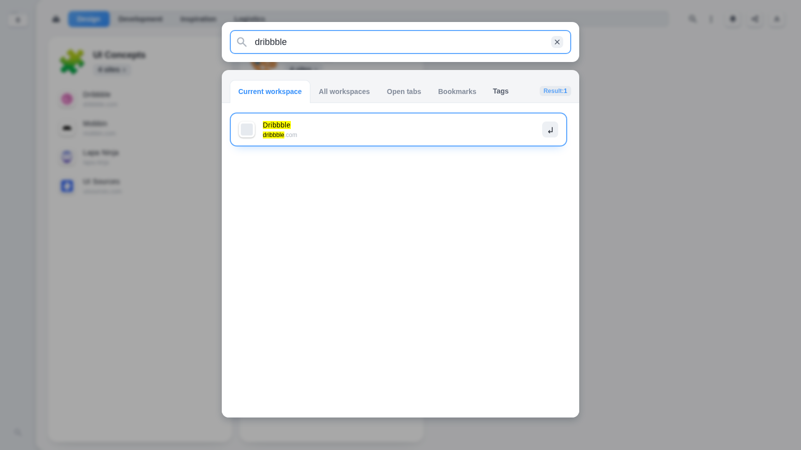
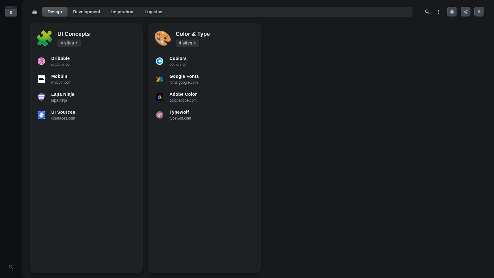
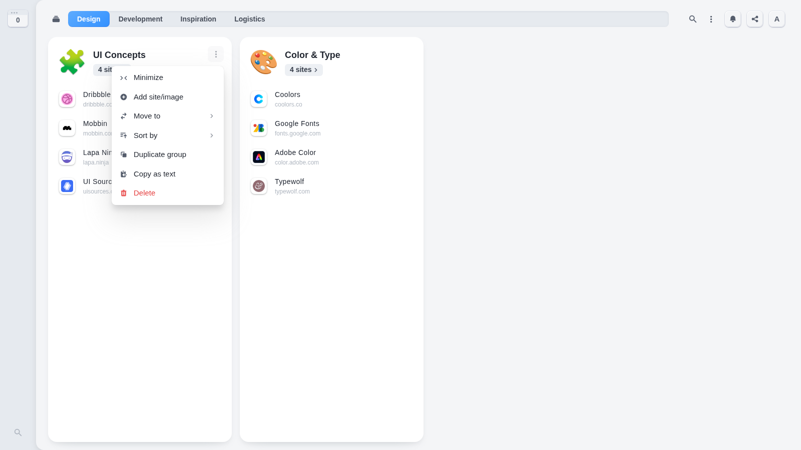

<p align="center">
  
</p>

<h1 align="center">TabX — Easy Tab Manager</h1>

<p align="center">
  <b>Turn your New Tab into a powerful, local-first workspace for your tabs, links, notes, and reminders.</b><br />
  Open-source Chrome Extension • Manifest V3 • No login required • Works fully offline
</p>

<p align="center">
  <a href="#-features"></a>
  <a href="#-roadmap"></a>
  <a href="#-getting-started"></a>
  <a href="LICENSE"></a>
  <a href="#-contributors"></a>
  
</p>

<p align="center">
  <a href="#-gallery">Screenshots</a> •
  <a href="#-features">Features</a> •
  <a href="#-keyboard-shortcuts">Shortcuts</a> •
  <a href="#-tech-stack">Tech stack</a> •
  <a href="#-getting-started">Getting started</a> •
  <a href="#-contributing">Contributing</a>
</p>

---

**TabX** replaces your browser's new-tab page with a beautiful dashboard where every group of tabs, link, idea, or to-do lives exactly where you expect it. Everything is stored locally on your device — no accounts, no cloud, no tracking.

---
<!-- markdownlint-disable MD033 -->

## 🖼️ Gallery

> Real screenshots captured from the extension running in Chromium.

| Light workspace | Instant search |
| --- | --- |
|  |  |

| Dark mode | Site actions |
| --- | --- |
|  |  |

## ✨ Features

- **Kanban-style tab dashboard** — organize tabs and links into groups and categories inside named workspaces, each with its own emoji identity.
- **Workspaces & categories** — tune the structure to any workflow: design, dev, study, groceries, travel, you name it.
- **Notes & todos** — keep a thought or checklist attached to any link.
- **Tags & tag trees** — local tag search with hierarchical tag organization.
- **Reminders** — schedule a tab to come back to it later.
- **Stacked sites** — collapse related links into a single stack.
- **Comments** — a quick annotation on any link.
- **Instant search** — search across current workspace, all workspaces, open tabs, bookmarks, and your tags (Ctrl/⌘ + Shift + F).
- **Deleted-tabs bin** — retrieve links you remove from the board.
- **Multi-user local profiles** — multiple people can keep separate boards on the same browser.
- **Toby import** — migrate an existing Toby export straight into TabX.
- **Keyboard-first** — one shortcut for everything you do most.
- **11 languages** — Arabic, English, Spanish, French, Greek, Indonesian, Japanese, Polish, Portuguese (BR), Swedish, and Vietnamese.
- **100% local-first** — `chrome.storage.local` only. Works offline, no login, no data leaves your machine.

## ⌨️ Keyboard shortcuts

| Shortcut | Windows / Linux | macOS | Action |
| --- | --- | --- | --- |
| Open TabX | `Ctrl + Shift + S` | `⌘ + Shift + S` | Open the TabX dashboard |
| Search | `Ctrl + Shift + F` | `⌘ + Shift + F` | Search all workspaces |
| Open bin | `Ctrl + Shift + Z` | `⌘ + Shift + Z` | Open the deleted-tabs bin |
| New group | `Ctrl + Shift + E` | `⌘ + Shift + E` | Create a new group |
| Toggle grid | — | — | Toggle workspace grid view |

## 🧰 Tech stack

Built as a plain, dependency-light Chrome Extension (Manifest V3):

- **JavaScript (ES2022)** — service worker (`background.js`) and UI (`newtab.js`) with no build step.
- **Chrome extension APIs** — `chrome.action`, `chrome.commands`, `chrome.contextMenus`, `chrome.favicon`, `chrome.runtime`, `chrome.side_panel`, `chrome.storage.local`, `chrome.tabs`, `chrome.tabGroups`.
- **React 18 + Chakra UI** — compiled UI runtime powering the dashboard and side panel.
- **Local-first storage** — user data, workspaces, tags, reminders, and the bin all live in `chrome.storage.local`.

## 📁 Project structure

```
.
├── background.js        # MV3 service worker: storage, messaging, import/export
├── newtab.js            # Dashboard & side panel UI (compiled)
├── toby.js              # Toby ⇄ TabX converter + native format validation
├── popover.js           # In-page popover helpers
├── tagMenu.js           # Tag tree menu UI
├── shadowToast.js       # Toast notifications (with sound effects)
├── manifest.json        # Extension config & keyboard commands
├── assets/
│   ├── html/            # tabx.html (new tab), sidebar.html (side panel)
│   ├── images/          # Logos, onboarding & empty-state art
│   ├── fx/              # Notification sound effects
│   └── screenshots/     # README screenshots (this repo)
├── _locales/            # 11 locales
└── tests/               # Toby import/export validation suite
```

## 🚀 Getting started

1. Clone this repository:

   ```bash
   git clone https://github.com/edree0x/TABX.git
   cd TABX
   ```

2. Open `chrome://extensions/` in Chrome (or any Chromium-based browser).

3. Enable **Developer mode** (top-right corner).

4. Click **Load unpacked** and select the project folder.

5. Press `Ctrl/⌘ + T` — your new-tab page is now TabX.

> No build step, no bundler, no registry installs. Open the folder, hit load.

### Running the test suite

```bash
node tests/toby.test.js path/to/your-toby-export.json
```

Validates Toby format detection, conversion, and the full import/export message path through the service worker.

## 🛣️ Roadmap

Ideas actively being shaped with the community:

- Collaborative workspaces (share a board with teammates)
- Optional cloud sync for cross-device continuity
- Bookmarks & open-tabs integration polish
- More import sources (OneTab, xBrowserSync, …)
- Mobile companion / PWA

Open an [issue](https://github.com/edree0x/TABX/issues) to propose features or join a roadmap discussion.

## 🤝 Contributing

TabX is a community project at heart. Contributions of all sizes are welcome — docs, translations, bug reports, and features.

See [CONTRIBUTING.md](CONTRIBUTING.md) for the full guide, the code of conduct in [CODE_OF_CONDUCT.md](CODE_OF_CONDUCT.md), and check out the existing [issues](https://github.com/edree0x/TABX/issues) for good first tasks.

### Localization

Want to add or improve a language? Add (or update) a folder under `_locales/<locale>/` following the structure of `_locales/en/`.

## 🧑‍🤝‍🧑 Contributors

> Names below are sample placeholders — replace them with the real handles of everyone who contributes to the project.

- [edree0x](https://github.com/edree0x) — founder & lead maintainer
- …and **you**? Open your first pull request.

## 💬 Support

- **Bugs & feature requests:** [GitHub Issues](https://github.com/edree0x/TABX/issues)
- **Questions:** reach out through a GitHub discussion on the repository.

<a href="https://www.buymeacoffee.com" target="_blank"></a>

## 📄 License

[MIT](LICENSE) © TabX contributors